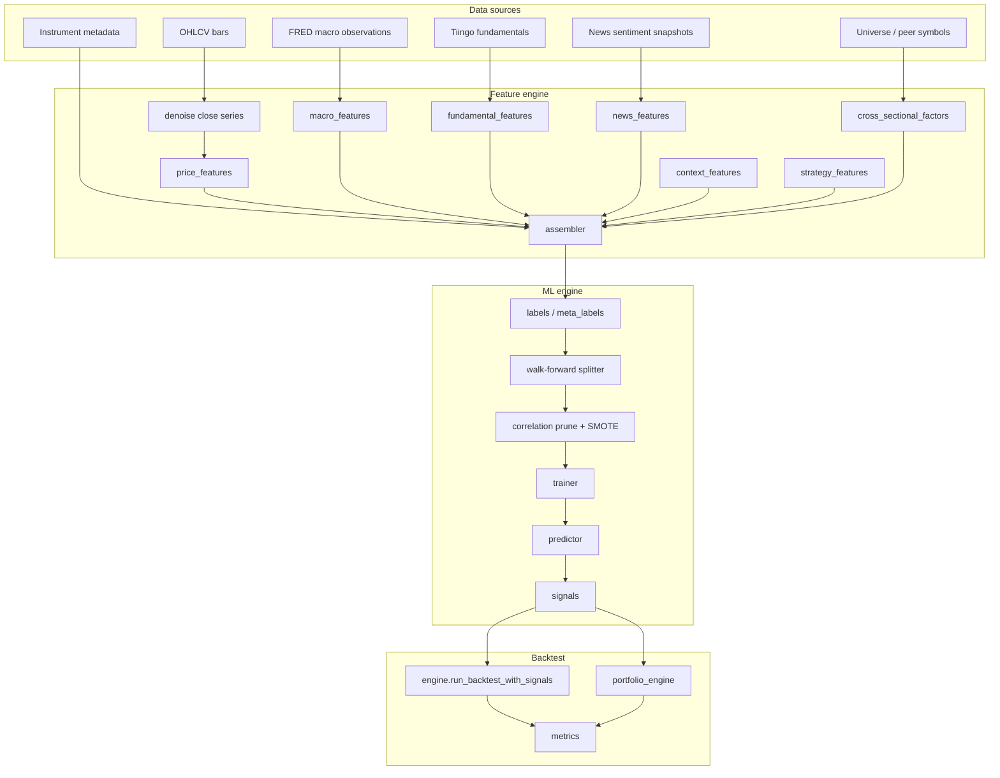
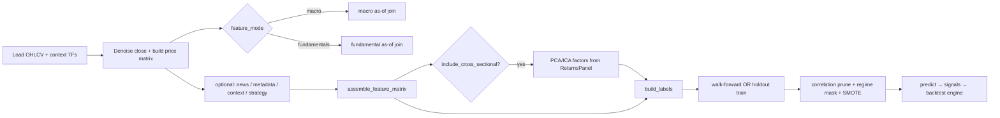

# ML Backtesting Manual

This document is the reference for machine-learning backtesting in the trading app. ML backtests reuse the existing portfolio simulator, performance metrics, and `backtest_runs` persistence. Only the **signal generation** path differs from rule-based algos: a classifier predicts the direction (or quality) of forward returns, and those predictions become buy/sell/hold signals.

For reinforcement learning (DDQN), see the separate RL backtest flow at `/backtesting/rl` — it shares universe listing but uses a different model catalog, training loop, and API prefix.

---

## Table of contents

1. [Quick start](#quick-start)
2. [Architecture](#architecture)
3. [ML wizard (UI workflow)](#ml-wizard-ui-workflow)
4. [ML Testing (trial-and-error lab)](#ml-testing-trial-and-error-lab)
5. [Prerequisites](#prerequisites)
5. [Run modes](#run-modes)
6. [Label modes and labeling search](#label-modes-and-labeling-search)
7. [Feature modes and data sources](#feature-modes-and-data-sources)
8. [Data preparation pipeline](#data-preparation-pipeline)
9. [Models](#models)
10. [Training aids](#training-aids)
11. [Search workflows](#search-workflows)
12. [Parameters reference](#parameters-reference)
13. [Walk-forward validation](#walk-forward-validation)
14. [Signals, exits, and simulation](#signals-exits-and-simulation)
15. [Evaluation metrics and explainability](#evaluation-metrics-and-explainability)
16. [Universe portfolio mode](#universe-portfolio-mode)
17. [Model persistence (train & inference)](#model-persistence-train--inference)
18. [Exports](#exports)
19. [REST API](#rest-api)
20. [Configuration](#configuration)
21. [Point-in-time rules (no look-ahead)](#point-in-time-rules-no-look-ahead)
22. [ML vs RL](#ml-vs-rl)
23. [Code map](#code-map)
24. [Troubleshooting](#troubleshooting)

---

## Quick start

1. **Ingest data** for your symbol: OHLCV bars (required), macro series (optional), fundamentals (optional), news sentiment (optional).
2. Open **Backtesting → ML** in the sidebar (`/backtesting/ml/:symbol`).
3. Follow the **seven-step wizard** (Universe → Data Prep → Labeling → Model → Signals → Run → Results).
4. On **Universe**, pick symbol, decision timeframe, date range, and walk-forward window sizes.
5. On **Data Prep**, choose feature mode and optional enrichments, then run **Preview data coverage** (required before advancing).
6. On **Labeling**, configure label mode and run **Label grid search**; apply the best row for your model(s).
7. On **Model**, pick a classifier (locked after labeling apply), optional correlation pruning, and hyperparameter search.
8. On **Signals**, run **Threshold grid search** and apply the best buy/sell pair (or confirm meta-label gate).
9. On **Run**, leave **Run mode** on **Walk-forward** and click **Run backtest**.
10. Review portfolio metrics, equity curve, ML summary, explainability charts, and trades on **Results**.

For a frozen model without retraining: train once with **Train & save**, then switch **Run mode** to **Use saved model** and run again.

**Crypto shortcut:** selecting a crypto symbol can apply the built-in crypto preset (macro liquidity series, news sentiment, meta-label with `crypto_trend_entry` base strategy, tuned walk-forward for 1h).

For rapid parameter experiments without wizard gates, use **Backtesting → ML Testing** (`/backtesting/ml-testing/:symbol`) — see [ML Testing (trial-and-error lab)](#ml-testing-trial-and-error-lab).

---

## ML Testing (trial-and-error lab)

**ML Testing** is a separate sidebar entry for iterative experiments. It does not replace the production ML wizard.

| Aspect | ML wizard (`/backtesting/ml`) | ML Testing (`/backtesting/ml-testing`) |
|--------|-------------------------------|----------------------------------------|
| Flow | Seven gated steps | Single screen: configure → run → compare |
| Model / label | Label grid search + apply | Direct dropdowns |
| Trial history | None in UI | Browser `localStorage` per symbol + timeframe |
| Data preview | Required to advance | Optional button |
| Finalize | Train & save on Run step | Train & save, or **Open in ML wizard** |

### Workflow

1. Pick symbol, timeframe, and date range.
2. Set **warmup**, **train**, **test**, and **step** bars (step = walk-forward simulation advance).
3. Choose **feature mode** (`prices_only` includes returns and `volume_rel_20`; macro/fundamentals modes add those blocks).
4. Optionally enable **algo strategy features** and **dynamic indicator selection** (choose momentum / mean reversion / volatility groups).
5. Pick **model** and **label mode** / horizon. When **meta-label** is selected, the **Meta-label trading** block appears:
   - **Base strategy** — which algo rule marks entry event bars (default `crypto_trend_entry`; distinct from algo strategy *features*).
   - **Meta gate threshold** — minimum P(success) to emit a buy on an event (default 0.65).
6. Click **Run backtest** — each run is appended to the trial table and compare grid.
7. Tweak parameters and run again; use **Load config** on a past row to restore settings.
8. Star the best row, **Train & save**, or open the config in the full ML wizard.

After a run completes, **Run detail** and the trial/compare tables show **signal counts** (`buy` / `sell` / `hold` in the simulation window) and **OOS windows** (walk-forward folds that actually trained). If **OOS windows = 0**, no model ran and every bar stays `hold` (0 trades) — common with **meta-label + LSTM** when each train window has too few base-strategy entry events. The backend lowers the per-fold event minimum for meta-label LSTM and shrinks the LSTM sequence to the event count; you can also shorten `lstm_seq_length`, pick a busier base strategy, or extend the date range. Zero buys with OOS windows &gt; 0 usually means the meta gate is too strict.

Sessions are stored under keys `ml-testing:v1:{SYMBOL}:{timeframe}` in `localStorage` (not on the server).

### `warmup_bars` parameter

Feature warmup is configurable via `params.warmup_bars` (default **200**, allowed range **50–500**). The first `warmup_bars` bars produce no feature rows (indicator lookback). **`train_bars` must be greater than `warmup_bars`.** Minimum bars:

```text
minimum_bars = warmup_bars + train_bars + test_bars + label_horizon
```

(for meta-label mode, `label_horizon` is replaced by `max_horizon_bars` in the minimum-bar calculation).

---

## Architecture

ML backtesting is a pipeline from raw data → features → labels → training/prediction → signals → simulation.



**Key design choices:**

| Topic | Behavior |
|-------|----------|
| Signal path | Precomputed per-bar signals fed into `run_backtest_with_signals` (single symbol) or `run_portfolio_backtest` (universe) |
| Validation | Walk-forward for training runs; holdout split for saved-model inference |
| Async jobs | Data preview, searches, train, and backtest run as background jobs (`202` + `job_id`) |
| Persistence | Runs stored in `backtest_runs`; optional saved models in `ml_models` |
| API prefix | `/api/v1/backtest/ml/...` |

---

## ML wizard (UI workflow)

**Route:** `/backtesting/ml/:symbol`

The ML page is a **seven-step wizard**. Advancing a step snapshots configuration (`MlLockedConfig`); going back invalidates downstream artifacts (preview, label search, threshold search, run results).

| Step | ID | Purpose | Gate to advance |
|------|----|---------|-----------------|
| 1 | `universe` | Symbol, decision timeframe, date range, walk-forward bars; optional universe ID / extra symbols | Valid bar count vs minimum bars |
| 2 | `data_prep` | Feature mode, macro/fundamentals, sentiment, denoise, cross-sectional, metadata, context TFs, strategy features | **Data preview job completed** |
| 3 | `labeling` | Label mode/method/horizon/threshold/meta params; multi-model label grid search | Label search run + **Apply** best row for all enabled models |
| 4 | `model` | Model type (locked after labeling apply), correlation prune, hyperparameter search, LSTM params | Valid model params |
| 5 | `signals` | Threshold grid search + apply (binary/ternary) or meta gate confirm | Threshold search run + **Apply** (or confirm for meta-label) |
| 6 | `run` | Run mode (walk-forward / saved model), initial cash, commission, execute backtest | Valid run config |
| 7 | `results` | Metrics, equity, ML summary, explainability, trades, workbook export | — |

**Info tooltips:** Every ML input label has a hover tooltip (`FieldLabel` + `mlBacktestHelp.ts`) explaining the parameter.

### Wizard artifacts

| Artifact | Set when | Invalidated when |
|----------|----------|------------------|
| `hasDataPreview` | Data preview job succeeds | Universe or data prep config changes |
| `hasLabelSearch` | Label search job completes | Labeling config changes |
| `hasLabelApplied` | User applies a label search row | Labeling config changes |
| `hasThresholdSearch` | Threshold search job completes | Signals config changes |
| `hasThresholdApplied` | User applies threshold row | Signals config changes |
| `hasRunResults` | Backtest job completes | Run config changes |

### Compare feature modes

The **Compare** action runs three backtests sequentially (`prices_only`, `prices_macro`, `prices_macro_fundamentals`) with the same symbol, range, model, and walk-forward settings. Results appear in a table with OOS accuracy, F1, total return, Sharpe, and signal counts.

---

## Prerequisites

### OHLCV bars (always required)

ML needs enough bars for feature warmup, walk-forward windows, and label horizon:

```
minimum_bars = warmup_bars (default 200) + train_bars + test_bars + label_horizon
```

For `meta_label` mode, `label_horizon` is replaced by `max_horizon_bars` in the minimum-bar calculation.

Walk-forward defaults scale with timeframe (e.g. ~252 train bars on daily, fewer on intraday). The UI auto-adjusts when bar count is limited.

### Macro data (for `prices_macro` and full mode)

Ingest FRED series via **Ingestion → FRED Macro**. Default series (rates + inflation from `SERIES_CATALOG`):

`DFF`, `DGS2`, `DGS10`, `T10Y2Y`, `CPIAUCSL`, `CPILFESL`, `PCEPI`

Series without ingested observations are omitted at run time; the UI shows a coverage warning.

### Fundamentals (for `prices_macro_fundamentals`)

Ingest Tiingo fundamentals for the symbol. The symbol must be **entitled** under your Tiingo fundamentals tier (DOW30 on free tier, or addon active). Non-entitled symbols receive a `400` error in full mode.

Sparse fundamentals coverage may introduce **survivorship bias** — warnings are surfaced in `ml_summary.fundamental_warnings`.

### News sentiment (optional)

Enable with `include_news_sentiment: true`. Requires sentiment ingestion and `SENTIMENT_ENABLED` in backend config. Adds four features: 24h/7d average score, article count, 7d momentum.

### Universe / cross-sectional factors (optional)

`include_cross_sectional_factors: true` requires a multi-symbol `ReturnsPanel` (from `universe_id` or `symbols[]`). Used for PCA/ICA factor loadings, market beta, and residual volatility per symbol.

---

## Run modes

### Walk-forward (default)

For each fold:

1. Train on the in-sample window (with optional SMOTE, correlation pruning, regime feature mask).
2. Predict probabilities on the out-of-sample window only.
3. Advance the window by `step_bars` and repeat.

Predictions exist **only** on OOS bars. In-sample bars have `null` probabilities → `hold` signals. This prevents training data from leaking into simulated trades.

Stored in `ml_summary.run_mode` as `walk_forward`.

### Use saved model (inference)

1. Train once via **Train & save** or `POST /backtest/ml/train`.
2. Training reserves the last **`test_bars`** labeled rows as a **holdout** set (not used for fitting).
3. Select the saved model and set **Run mode** to **Use saved model**.
4. Inference evaluates ML metrics and portfolio simulation on the holdout window by default.

Inference validates:

- `feature_mode` matches the saved model
- Feature names and order match `feature_schema` exactly
- Saved model includes holdout metadata (`holdout_start`, `holdout_start_bar_index`). **Legacy models** trained before this split must be retrained.

Optional `inference_eval_scope`:

| Value | Behavior |
|-------|----------|
| `holdout` (default) | Metrics and trades on holdout bars only |
| `in_sample` | Full training range (diagnostics only; not deployable performance) |

Inference runs do **not** produce walk-forward OOS accuracy (`oos_window_count: 0`).

Stored in `ml_summary.run_mode` as `inference`.

### Universe portfolio

Triggered when `universe_id` or multiple `symbols[]` are set on `POST /backtest/ml/run`.

1. Per-symbol walk-forward (or inference on the **primary** symbol only).
2. Signals aggregated into `signals_by_symbol`.
3. Portfolio simulation via `run_portfolio_backtest` with sizing (`fixed_fraction`, `kelly`, or `hrp`).

Stored in `ml_summary.run_mode` as `universe_portfolio`. Includes `per_symbol_summaries`, `survivorship_warnings`, and `target_weights`.

**Note:** `POST /backtest/ml/universe/run` is a separate synchronous endpoint for replaying **precomputed** signals (no ML training).

---

## Label modes and labeling search

### Label modes

| Mode | Definition | Classes | Default model pairing |
|------|------------|---------|----------------------|
| `binary` | Forward return > 0 | 0 = down, 1 = up | Logistic, GB, XGBoost, KNN |
| `ternary` | Forward return vs ±`label_threshold` | 0 = neutral, 1 = down, 2 = up | Random Forest |
| `meta_label` | Base strategy entry events only; ATR profit/stop bracket labels | 0 = loss/stop, 1 = profit | LSTM (default) |

**Label methods** (`label_method`):

| Method | Behavior |
|--------|----------|
| `endpoint` (default) | Compare close at bar `i + label_horizon` to close at `i` |
| `mean` | Compare mean of intermediate closes to entry close |

### Meta-label parameters

| Parameter | Default | Purpose |
|-----------|---------|---------|
| `base_strategy_id` | `crypto_trend_entry` | Strategy that generates entry event bars |
| `base_strategy_params` | `{}` | Params passed to the base strategy |
| `profit_atr_mult` | 2.0 | ATR multiple for profit target |
| `stop_atr_mult` | 1.5 | ATR multiple for stop loss |
| `max_horizon_bars` | 48 | Max bars to wait for bracket hit |
| `meta_gate_threshold` | 0.65 | Probability gate for taking meta-label trades |
| `atr_period` | 14 | ATR lookback for bracket levels |

Meta-labels are built only on bars where the base strategy fires a buy signal. The classifier learns whether that entry would have hit profit before stop within `max_horizon_bars`.

### Label grid search

Async job: `POST /backtest/ml/label-search`

- **Horizon grid:** center `label_horizon` ± offsets `(-4, -2, 0, 2, 4)`, clamped to `[1, 60]`.
- **Threshold grid:** for ternary mode, sweeps `label_threshold` values.
- **Multi-model matrix:** pass `model_configs[]` with `{ model_type, label_mode }` per row; legacy single `model_type` still supported.
- **Scoring:** sort by `f1_macro`, then `accuracy`; each combo runs full walk-forward classification.
- **Meta-label:** only one combo is evaluated (labels depend on strategy params, not horizon grid).

The UI requires label search + **Apply** before leaving the Labeling step.

---

## Feature modes and data sources

### Feature modes (`feature_mode`)

| Mode | Label | Includes |
|------|-------|----------|
| `prices_only` | Prices only | OHLCV-derived features |
| `prices_macro` | Prices + macro | OHLCV + selected FRED series |
| `prices_macro_fundamentals` | Full | OHLCV + macro + fundamentals |

Optional blocks merge in **any** feature mode via `assembler.assemble_feature_matrix`:

| Category | Flag / trigger | What it does |
|----------|----------------|--------------|
| **Price / technical** | Always (base) | 21 columns from OHLCV — see below |
| **Denoising** | `denoise_method`: `none` \| `kalman` \| `wavelet` | Applied to close series before indicators |
| **Macro** | `feature_mode` includes macro | FRED series + optional publication lag |
| **Fundamentals** | `prices_macro_fundamentals` | 17 default metrics; quarterly or annual |
| **News sentiment** | `include_news_sentiment` | 4 sentiment columns |
| **Metadata** | `include_metadata_features` | One-hot sector/industry from instrument metadata |
| **Context timeframes** | `context_timeframes[]` | Higher-TF `ret_5`, `ret_20`, `rsi_14`, `sma20_dist` per TF |
| **Strategy features** | `strategy_feature_ids[]` | Ensemble-eligible strategy signals as numeric features |
| **Cross-sectional factors** | `include_cross_sectional_factors` + multi-symbol panel | PCA/ICA loadings, market beta, residual vol |
| **Regime selection** | `dynamic_indicator_selection` | Per-fold vol regime → subset of indicator groups |
| **Correlation pruning** | `correlation_prune_threshold` (default 0.75) | Pearson prune within each train fold |

**Volume:** `volume_rel_20` (current volume vs 20-bar average) is always included and cannot be disabled (`ALWAYS_INCLUDED_FEATURE_IDS`).

### Price features (`price_features.py`)

Built from OHLCV. The first **`warmup_bars`** bars (default 200, configurable 50–500) produce no feature row.

| Feature | Description |
|---------|-------------|
| `ret_1`, `ret_5`, `ret_20` | Percent returns over 1, 5, 20 bars |
| `vol_20` | Rolling 20-bar return volatility |
| `rsi_14` | 14-bar RSI |
| `sma20_dist`, `sma50_dist` | Distance from close to SMA (ratio − 1) |
| `hl_range` | (high − low) / close |
| `atr_14` | 14-bar ATR |
| `ema20_dist`, `ema50_dist`, `ema200_dist` | Distance from close to EMA |
| `macd_line`, `macd_signal`, `macd_hist` | MACD components |
| `bb_pct_b`, `bb_width` | Bollinger band position and width |
| `obv_slope_5` | 5-bar OBV slope |
| `ichimoku_tenkan_dist`, `ichimoku_kijun_dist` | Ichimoku cloud distances |
| `volume_rel_20` | Volume vs 20-bar average (always on) |

Other price columns (`ret_1`, MACD, Bollinger, Ichimoku, etc.) are always computed but may be masked per fold when **dynamic indicator selection** is enabled (see below).

#### Optional algo strategy columns

Activated via `strategy_feature_ids[]` (ensemble-eligible algos from the backtest strategy catalog). Available in **every** `feature_mode` because OHLCV price features are always built first; macro and fundamentals columns are appended afterward.

| Column pattern | Description |
|----------------|-------------|
| `strat_{strategy_id}_signal` | Encoded buy/hold/sell signal (−1, 0, +1) |
| `strat_{strategy_id}_cont_0` | Primary continuous feature for that strategy |
| `strat_{strategy_id}_cont_1` | Second continuous feature (e.g. crossover strategies) |

Lookbacks count **bars**, not calendar time — the same feature names apply across timeframes.

### Denoising (`denoising.py`)

Applied to the close series **before** indicator computation:

| Method | Description |
|--------|-------------|
| `none` | Raw closes (default) |
| `kalman` | Kalman filter smoothing |
| `wavelet` | Wavelet denoising |

### Macro features (`macro_features.py`)

For each selected FRED series, four columns:

| Column | Description |
|--------|-------------|
| `{series}_level` | Latest observation on or before bar date (forward-filled) |
| `{series}_chg_1m` | Percent change vs prior observation |
| `{series}_chg_3m` | 3-month-style change |
| `{series}_days_since_update` | Calendar days since last observation |

**As-of join:** `asof_join.py` aligns irregular macro releases to bar dates. Optional `macro_publication_lag_days` (keyed by series category) shifts the lookup date backward to model publication delay.

### Fundamental features (`fundamental_features.py`)

For each selected metric, four columns:

| Column | Description |
|--------|-------------|
| `{metric}_level` | Latest value as-of report **publication date** |
| `{metric}_yoy` | Year-over-year percent change |
| `{metric}_qoq` | Quarter-over-quarter percent change |
| `{metric}_quarters_since_report` | Days since last report ÷ 91.25 |

**Default metrics:** revenue, grossProfit, opinc, netinc, eps, ebitda, freeCashFlow, ncfo, totalAssets, debt, equity, roe, roa, debtEquity, grossMargin, profitMargin, currentRatio.

**Period type:** `quarterly` (fiscal quarters) or `annual` (FY statements).

### News sentiment features (`news_features.py`)

When `include_news_sentiment: true`:

| Feature | Description |
|---------|-------------|
| `news_sentiment_24h` | Average sentiment score over last 24h |
| `news_sentiment_7d` | Average sentiment score over last 7d |
| `news_article_count_7d` | Article count in last 7d |
| `news_sentiment_momentum_7d` | 7d score change vs prior 7d |

### Metadata features (`metadata_features.py`)

When `include_metadata_features: true`: one-hot encoded sector and industry from instrument metadata.

### Context timeframe features (`context_features.py`)

For each entry in `context_timeframes[]` (must be a valid higher timeframe): `ret_5`, `ret_20`, `rsi_14`, `sma20_dist` prefixed by timeframe.

### Strategy features (`strategy_features.py`)

For each `strategy_feature_ids[]` entry (must be an ensemble-eligible strategy from `ENSEMBLE_LEG_STRATEGIES`): numeric signal and continuous columns per bar (see [Optional algo strategy columns](#optional-algo-strategy-columns)). Works with `prices_only`, `prices_macro`, and `prices_macro_fundamentals` because the price matrix is always the base layer.

### Cross-sectional factors (`cross_sectional_factors.py`)

Requires multi-symbol `ReturnsPanel`. Per bar, per symbol:

| Feature | Description |
|---------|-------------|
| `pca_factor_1_loading` | First PCA component loading on peer returns |
| `market_beta` | Beta vs equal-weight market return |
| `residual_vol` | Idiosyncratic volatility |

Optional ICA mode via internal `use_ica` flag in factor builder.

### Regime-based feature selection (`regime_features.py`)

When `dynamic_indicator_selection: true`, each walk-forward train fold:

1. Classifies the trailing vol regime (`low_vol`, `mid_vol`, `high_vol`).
2. Picks **one enabled group** from `indicator_groups[]` (default: all three): low vol → mean reversion, mid vol → momentum, high vol → volatility. If the preferred group is disabled, the next enabled group is used.
3. Masks training features to the top indicators from that group (subset of the table below).

Restrict participation with `indicator_groups`: e.g. `["momentum", "volatility"]` excludes mean-reversion indicators from regime selection.

| Group | Features |
|-------|----------|
| `momentum` | `ret_5`, `ret_20`, `ema20_dist`, `ema50_dist` |
| `mean_reversion` | `rsi_14`, `sma20_dist`, `sma50_dist` |
| `volatility` | `vol_20`, `atr_14`, `hl_range` |

Regime masking applies only to **core price indicators in these groups**. It does not remove `strat_*` algo strategy columns, `volume_rel_20`, or indicators outside these groups (e.g. MACD) via the same mask — see predictor mask behavior in `predictor.py`.

---

## Data preparation pipeline



### Data preview (wizard step 2)

Async job: `POST /backtest/ml/data-preview`

Builds the same feature matrix used by walk-forward training, not just raw price labels.

| Stat | Meaning |
|------|---------|
| Label distribution | Up/down/neutral counts from configured label mode |
| Valid feature rows | Bars with a complete merged feature vector after warmup |
| Trainable rows | Bars with both valid features and a label |
| Structural folds | Window count from bar math only |
| Viable folds | Folds where train window has enough samples and both classes |

**Structural folds** count windows by bar math only; **viable folds** from preview reflect whether training can actually run. If viable folds are zero, fix coverage (uncheck optional features, extend date range, or increase train bars above the 200-bar warmup) before running label grid search.

After preview, the **Model training columns** card lists every feature name grouped by source (price/technical, volume, macro, news, context, algo strategy, etc.).

Macro coverage includes ALFRED release-date percentage per series.

---

## Models

Six supervised classifiers are available via `ML_MODEL_CATALOG`:

| ID | Label | Library | Default label mode | Hyperparameter search |
|----|-------|---------|-------------------|----------------------|
| `ml_logistic` | Logistic Regression | sklearn `LogisticRegression` | `binary` | No |
| `ml_random_forest` | Random Forest | sklearn `RandomForestClassifier` | `ternary` | Yes |
| `ml_gradient_boosting` | Gradient Boosting | sklearn `HistGradientBoostingClassifier` | `binary` | Yes |
| `ml_xgboost` | XGBoost | XGBoost (optional dep) | `binary` | Yes |
| `ml_knn` | K-Nearest Neighbors | sklearn `KNeighborsClassifier` (scaled pipeline) | `binary` | Yes |
| `ml_lstm` | Stacked LSTM | PyTorch LSTM (`requirements-deep-learning.txt`) | `meta_label` | No |

All models predict **probability of the positive class** (or class probabilities for ternary). The trainer uses `random_state=42` for reproducibility where applicable.

### Model-specific parameters

| Model | Parameter | Default | Range |
|-------|-----------|---------|-------|
| Random Forest | `random_forest_estimators` | 100 | 10 – 500 |
| Gradient Boosting | `gradient_boosting_max_iter` | 100 | 10 – 500 |
| XGBoost | `xgboost_estimators` | — | 10 – 500 |
| XGBoost | `xgboost_max_depth` | — | 2 – 16 |
| XGBoost | `xgboost_learning_rate` | — | 0.01 – 0.5 |
| KNN | `knn_neighbors` | — | 1 – 50 |
| LSTM | `lstm_seq_length` | 32 | 8 – 128 |
| LSTM | `lstm_hidden_size` | 64 | 16 – 256 |
| LSTM | `lstm_num_layers` | 2 | 1 – 4 |
| LSTM | `lstm_epochs` | 10 | 1 – 100 |
| LSTM | `lstm_dropout` | 0.2 | 0.0 – 0.5 |
| LSTM | `lstm_learning_rate` | 0.001 | 0.0001 – 0.01 |
| LSTM | `lstm_batch_size` | 32 | — |

### LSTM sequence model

- Builds sliding windows of length `lstm_seq_length` over the tabular feature matrix (`sequence_builder.py`).
- Sklearn-compatible API wrapping PyTorch (`models/lstm_classifier.py`).
- **No SMOTE** — sequence integrity is preserved.
- Minimum train samples must exceed sequence length per fold.

---

## Training aids

### SMOTE (class imbalance)

- Controlled by `use_smote` (default **true**).
- Applied per walk-forward train fold when minority class ratio < 15% and ≥ 6 samples (`imbalance.py`).
- **Skipped** for `ml_lstm` and when `imblearn` is not installed.
- Data preview warns if label distribution is > 85% one class.

### Correlation pruning

- `correlation_prune_threshold` (default **0.75**): within each train fold, drop one feature from each pair with Pearson correlation above the threshold (`correlation_selection.py`).
- Set to `1.0` to disable (keep all features).

### Regime-based feature masking

See [Regime-based feature selection](#regime-based-feature-selection-regime_featurespy) above. Enabled with `dynamic_indicator_selection: true`.

---

## Search workflows

All search endpoints return `202 Accepted` with a `job_id`. Poll job status via the standard jobs API.

| Job type | Endpoint | Purpose |
|----------|----------|---------|
| `ml_data_preview` | `POST /data-preview` | Feature matrix preview and walk-forward readiness |
| `ml_label_search` | `POST /label-search` | Horizon/threshold grid across models |
| `ml_threshold_search` | `POST /threshold-search` | Buy/sell or min-class-probability grid |
| `ml_hyperparameter_search` | `POST /hyperparameter-search` | GridSearchCV on train fold (RF, GB, KNN, XGBoost) |
| `ml_training_export` | `POST /training-data-export` | CSV export of labeled feature matrix |
| `ml_workbook_export` | `POST /workbook-export` | Multi-sheet Excel workbook |
| `ml_train` | `POST /train` | Train and persist saved model |
| `ml_backtest` | `POST /run` | Walk-forward, inference, or universe backtest |

### Threshold search

Async job: `POST /backtest/ml/threshold-search`

| Label mode | Search behavior |
|------------|-----------------|
| `binary` / `meta_label` | Grid of buy/sell pairs; **PnL-ranked** via mini backtest on OOS probabilities. Sort: profit factor → return → Sharpe → f1_macro |
| `ternary` | `min_class_probability` gates (default grid: None, 0.55, 0.6); class-based signals |

**Meta-label trading** uses `meta_gate_signals` with `meta_gate_threshold` (not buy/sell thresholds).

Default buy grid: ~0.52 – 0.60. Default sell grid: ~0.40 – 0.48.

### Hyperparameter search

Async job: `POST /backtest/ml/hyperparameter-search`

Supported for: Random Forest, Gradient Boosting, KNN, XGBoost. Uses `GridSearchCV` on the in-sample portion of the first viable walk-forward fold. Best params are returned in the job result for manual apply.

---

## Parameters reference

### Core defaults (daily timeframe)

```json
{
  "feature_mode": "prices_only",
  "label_mode": "binary",
  "label_threshold": 0.01,
  "label_method": "endpoint",
  "label_horizon": 5,
  "train_bars": 252,
  "test_bars": 63,
  "step_bars": 63,
  "buy_threshold": 0.55,
  "sell_threshold": 0.45,
  "denoise_method": "none",
  "include_cross_sectional_factors": false,
  "include_metadata_features": false,
  "include_news_sentiment": false,
  "dynamic_indicator_selection": false,
  "indicator_groups": ["momentum", "mean_reversion", "volatility"],
  "correlation_prune_threshold": 0.75,
  "use_smote": true,
  "sizing_method": "fixed_fraction",
  "inference_eval_scope": "holdout",
  "exit_policy": "label_horizon",
  "atr_period": 14,
  "random_forest_estimators": 100,
  "gradient_boosting_max_iter": 100
}
```

### Timeframe-aware defaults

When timeframe changes, walk-forward defaults auto-scale via `bars_per_year`:

| Timeframe | Typical train | Typical test/step | Label horizon |
|-----------|---------------|-------------------|---------------|
| Intraday (e.g. `1h`) | Scaled to ~1 year of bars | ~63/252 of train | 5 |
| `1d` | 252 | 63 | 5 |
| `1w` | 52 | ~13 | 4 |
| `1mo` | 12 | ~3 | 3 |

Crypto 1h uses a shorter train window (~half a year of bars). Intraday runs also respect `INTRADAY_BAR_LIMIT` — the UI may shrink train/test to fit available bars.

### Constraints (enforced server-side)

| Parameter | Range |
|-----------|-------|
| `label_horizon` | 1 – 60 |
| `label_threshold` | 0.001 – 0.1 |
| `train_bars` | 10 – 2000 |
| `test_bars` | 1 – 500 |
| `step_bars` | 1 – 500 |
| `buy_threshold` | 0.51 – 0.99 |
| `sell_threshold` | 0.01 – 0.49 |
| `meta_gate_threshold` | 0.51 – 0.99 |
| `correlation_prune_threshold` | 0 – 1 |
| `random_forest_estimators` | 10 – 500 |
| `gradient_boosting_max_iter` | 10 – 500 |

**Rule:** `buy_threshold` must be **greater than** `sell_threshold`.

### Crypto preset (`CRYPTO_ML_PRESET`)

Applied when selecting crypto symbols in the UI:

| Setting | Value |
|---------|-------|
| `feature_mode` | `prices_macro` |
| `macro_series_ids` | `T10Y2Y`, `WALCL`, `WTREGEN` |
| `include_news_sentiment` | `true` |
| `label_mode` | `meta_label` |
| `base_strategy_id` | `crypto_trend_entry` |
| `profit_atr_mult` / `stop_atr_mult` | 2.0 / 1.5 |
| `max_horizon_bars` | 48 |
| `meta_gate_threshold` | 0.65 |
| `commission_bps` / `slippage_bps` | 20 / 5 |

---

## Walk-forward validation

Windows are built by `splitter.build_walk_forward_windows`:

```
train:  [train_start, train_start + train_bars)
test:   [train_end, train_end + test_bars)
next:   train_start += step_bars
```

Example with `train=252`, `test=63`, `step=63` on daily data:

- Fold 1: train bars 0–251, test 252–314
- Fold 2: train bars 63–314, test 315–377
- … until test window exceeds bar count

Folds with fewer than 2 labeled samples or only one class are skipped.

**Labels** use future returns (`labels.py`) or meta-label events (`meta_labels.py`). Labels are used **only** for training and evaluation — never as features.

---

## Signals, exits, and simulation

### Signal mapping (`signals.py`)

**Binary:**

| Condition | Signal |
|-----------|--------|
| `prob >= buy_threshold` | `buy` |
| `prob <= sell_threshold` | `sell` |
| otherwise | `hold` |
| `prob is null` | `hold` |

**Ternary:**

| Condition | Signal |
|-----------|--------|
| Predicted class 2 (up) with prob ≥ `min_class_probability` (if set) | `buy` |
| Predicted class 1 (down) | `sell` |
| Class 0 (neutral) or below gate | `hold` |

**Meta-label:**

| Condition | Signal |
|-----------|--------|
| Event bar + `prob >= meta_gate_threshold` | `buy` |
| Otherwise on event bars | `hold` |

The simulator (`run_backtest_with_signals`) executes trades at the **next bar open** after a signal, with commission and optional slippage applied per trade. This matches rule-based algo execution semantics.

### Trade exit policies

Configure via `params.exit_policy` (auto-defaults by `label_mode` when omitted):

| Policy | Default for | Behavior |
|--------|-------------|----------|
| `label_horizon` | `binary` | Close long at bar open after `max_hold_bars` (defaults to `label_horizon`) |
| `atr_bracket` | `meta_label` | Intrabar stop (`stop_atr_mult` × ATR) or target (`profit_atr_mult` × ATR) from entry |
| `combined` | — | First of: ATR stop/target, max-hold, or sell signal |
| `signal_only` | — | Legacy: hold until sell signal only |

Trade records include `exit_reason`: `signal`, `max_hold`, `stop_atr`, `profit_atr`.

---

## Evaluation metrics and explainability

Stored in `ml_summary` on each run (also in `backtest_runs.params.ml_summary`):

### Classification metrics

| Field | Walk-forward | Inference |
|-------|--------------|-------------|
| `mean_oos_accuracy` | Mean accuracy across OOS folds | `null` |
| `window_accuracies` | Per-fold accuracies | `[]` |
| `oos_window_count` | Number of folds | `0` |
| `precision`, `recall`, `f1`, `f1_macro` | Over all OOS predictions | Over **holdout** labeled bars only (default) |
| `confusion_matrix` | N×N matrix | Same |
| `confusion_labels` | Class label order | Same |
| `roc_curves`, `auc_scores` | One-vs-rest ROC + AUC | Same |
| `evaluation_scope` | `walk_forward_oos` | `holdout` or `in_sample` |
| `holdout_start_date`, `holdout_bars` | — | Holdout window metadata |
| `signal_counts` | `{ buy, sell, hold }` | Same |
| `feature_names` | Ordered column names used | Same |
| `macro_warnings`, `fundamental_warnings`, `survivorship_warnings` | Data coverage notes | Same |

### Basic explainability

| Field | Models |
|-------|--------|
| `feature_importance` | Tree models (RF, GB, XGBoost) |
| `coefficient_importance` | Logistic regression |
| `shap_importance` | TreeSHAP (RF/XGB), LinearSHAP (logistic), permutation fallback (GB/KNN/LSTM) |

### Advanced explainability (backtest runs only)

Enriched via `explainability_advanced.enrich_ml_summary_advanced`:

| Field | Description |
|-------|-------------|
| `shap_interactions` | Top pairwise SHAP interaction strengths |
| `partial_dependence` | Marginal P(up) vs feature grid for top 3 SHAP features |
| `shap_slices` | SHAP by winning vs losing trade PnL deciles |
| `tree_rules` | Representative tree rules export (depth 4) for tree models |

### Portfolio metrics window

Portfolio metrics (return, Sharpe, drawdown, alpha vs buy-and-hold, etc.) come from the standard backtest metrics module. They are computed on the **evaluation window**, not the full loaded date range:

| Concept | Field | Meaning |
|---------|-------|---------|
| Walk-forward OOS boundary | `simulation_start_date` | First bar after `train_bars`; in-sample bars excluded from portfolio simulation |
| Portfolio evaluation window | `evaluation_start_date` | Start of the period used for equity curve, trades, and portfolio metrics |
| Evaluation anchor | `evaluation_reason` | `first_trade` when the strategy enters the market; `simulation_start` when there are no trades |

When the strategy has trades, portfolio simulation is re-run from the signal bar before the first entry so both the strategy and the buy-and-hold benchmark restart at `initial_cash` on the same date.

---

## Universe portfolio mode

| Aspect | Single symbol | Universe / multi-symbol |
|--------|---------------|-------------------------|
| Entry | `MlRunRequest` with one `symbol` | `symbols[]` and/or `universe_id` on `/run` |
| ML training | One feature matrix + labels | Per-symbol walk-forward; shared `ReturnsPanel` for cross-sectional |
| Simulation | `run_backtest_with_signals` | `run_portfolio_backtest` |
| Sizing | Single-asset | `sizing_method`: `fixed_fraction`, `kelly`, `hrp` |
| Summary | Standard `ml_summary` | `run_mode: universe_portfolio`, per-symbol summaries |

### Portfolio sizing parameters

| Parameter | Default | Description |
|-----------|---------|-------------|
| `sizing_method` | `fixed_fraction` | `fixed_fraction`, `kelly`, or `hrp` |
| `kelly_fraction` | 0.25 | Fraction of full Kelly when using Kelly sizing |
| `hrp_lookback_bars` | 252 | Lookback for HRP covariance estimation |
| `rebalance_frequency` | 21 | Bars between portfolio rebalances |
| `hrp_linkage_method` | `single` | Hierarchical clustering linkage |

**Saved model in universe:** inference is applied to the **primary** symbol only; other symbols always walk-forward.

---

## Model persistence (train & inference)

### Database

Table `ml_models`:

| Column | Purpose |
|--------|---------|
| `id` | UUID primary key |
| `name` | User-visible name |
| `model_type` | e.g. `ml_random_forest` |
| `feature_mode` | Must match at inference |
| `feature_schema` | JSON `{ version, feature_names[] }` |
| `hyperparams` | Full validated param snapshot |
| `train_metrics` | Accuracy, precision, recall, F1, sample count, holdout metrics |
| `artifact_path` | Path to joblib (or PyTorch) file on disk |
| `created_at` | Timestamp |

### Artifacts

Serialized models stored as `{uuid}.joblib` (sklearn) or PyTorch checkpoint under `ML_ARTIFACT_DIR` (default `./data/ml_models`).

### Train workflow

1. UI: **Train & save** or API: `POST /backtest/ml/train`
2. Builds features + labels for the full date range
3. Trains on all labeled rows **except** the last `test_bars` holdout
4. Persists metadata + artifact
5. Returns model id for inference runs

### Inference workflow

1. Set `params.model_id` on `POST /backtest/ml/run`
2. Server loads artifact, validates schema and feature mode
3. Predicts on holdout (or full range if `inference_eval_scope: in_sample`); no retraining

---

## Exports

### Training data CSV

`POST /backtest/ml/training-data-export`

| Scope | Description |
|-------|-------------|
| `all_labeled` | All bars with valid features and labels |
| `sample` | Random sample |
| `oos_only` | Out-of-sample bars only |

Max 50,000 rows. Returns base64-encoded CSV in job result.

### Workbook export

`POST /backtest/ml/workbook-export`

Multi-sheet Excel workbook. Sheets included based on available data:

| Sheet | Content |
|-------|---------|
| `Overview` | Sheet index and row counts |
| `Config` | Symbol, model, wizard config snapshot |
| `Data_Preview` | Preview stats and walk-forward readiness |
| `Macro_Coverage` | ALFRED release-date coverage by series |
| `Label_Search` | Label grid search results |
| `Threshold_Search` | Threshold grid search results |
| `Training_Data` | Labeled feature matrix |
| `ML_Summary` | OOS ML metrics and run metadata |
| `Confusion_Matrix` | Confusion matrix counts |
| `Window_Accuracies` | Per-fold OOS accuracy |
| `Feature_Importance` | Model feature importance |
| `SHAP_Importance` | Mean absolute SHAP values |
| `SHAP_Interactions` | Pairwise SHAP interactions |
| `Partial_Dependence` | Marginal P(up) curves |
| `SHAP_Trade_Slices` | SHAP by winning/losing trade deciles |
| `Tree_Rules` | Tree rules export |
| `ROC_Points` | ROC curve points by class |
| `Portfolio_Metrics` | Backtest performance metrics |
| `Equity_Curve` | Strategy and benchmark equity |
| `Trades` | Simulated trade list |
| `Feature_Mode_Compare` | Compare panel results |

Optional inputs: `run_id`, wizard `config_snapshot`, cached search results.

---

## REST API

Base path: `/api/v1/backtest/ml`

| Method | Path | Description |
|--------|------|-------------|
| `GET` | `/models` | Algorithm catalog (types, defaults, constraints, hyperparameter search flag) |
| `GET` | `/saved-models` | List persisted models |
| `GET` | `/saved-models/{id}` | Single saved model metadata |
| `DELETE` | `/saved-models/{id}` | Delete saved model |
| `POST` | `/data-preview` | Async data preview job |
| `POST` | `/label-search` | Async label grid search |
| `POST` | `/threshold-search` | Async threshold grid search |
| `POST` | `/hyperparameter-search` | Async hyperparameter search |
| `POST` | `/training-data-export` | Async training CSV export |
| `POST` | `/workbook-export` | Async Excel workbook export |
| `POST` | `/train` | Train on date range and persist |
| `POST` | `/run` | Walk-forward, inference, or universe backtest |
| `GET` | `/universes` | List universe definitions |
| `POST` | `/universe/run` | Sync portfolio backtest with precomputed signals |
| `GET` | `/{run_id}/results` | Full results including `ml_summary` |

All async endpoints return `202 Accepted` with `{ job_id }`. Poll via the jobs API.

### Example: walk-forward run

```http
POST /api/v1/backtest/ml/run
Content-Type: application/json

{
  "symbol": "AAPL",
  "model_type": "ml_logistic",
  "timeframe": "1d",
  "start": "2020-01-01T00:00:00Z",
  "end": "2024-12-31T00:00:00Z",
  "initial_cash": 10000,
  "commission_bps": 0,
  "params": {
    "feature_mode": "prices_only",
    "label_mode": "binary",
    "label_horizon": 5,
    "train_bars": 252,
    "test_bars": 63,
    "step_bars": 63,
    "buy_threshold": 0.55,
    "sell_threshold": 0.45,
    "use_smote": true,
    "correlation_prune_threshold": 0.75
  }
}
```

### Example: universe portfolio run

```http
POST /api/v1/backtest/ml/run

{
  "symbol": "AAPL",
  "symbols": ["AAPL", "MSFT", "GOOGL"],
  "model_type": "ml_random_forest",
  "timeframe": "1d",
  "params": {
    "feature_mode": "prices_macro",
    "label_mode": "ternary",
    "sizing_method": "hrp",
    "include_cross_sectional_factors": true
  }
}
```

### Example: inference run

```http
POST /api/v1/backtest/ml/run

{
  "symbol": "AAPL",
  "model_type": "ml_random_forest",
  "timeframe": "1d",
  "params": {
    "feature_mode": "prices_macro",
    "model_id": "550e8400-e29b-41d4-a716-446655440000",
    "macro_series_ids": ["DFF", "DGS10"],
    "buy_threshold": 0.55,
    "sell_threshold": 0.45,
    "inference_eval_scope": "holdout"
  }
}
```

### Error responses

| Status | Typical cause |
|--------|---------------|
| `400` | Invalid params, insufficient bars, schema mismatch, non-entitled fundamentals |
| `404` | Unknown symbol, saved model, or run |
| `500` | Unexpected training/simulation failure (run marked `failed` in DB) |

---

## Configuration

| Variable | Default | Description |
|----------|---------|-------------|
| `ML_ARTIFACT_DIR` | `./data/ml_models` | Directory for model artifact files |
| `SENTIMENT_ENABLED` | — | Must be true for news sentiment features |

Set in backend `.env`. Artifact directory is created automatically on first save.

Tiingo fundamentals entitlement is controlled by `tiingo_fundamentals_tier` in backend config.

LSTM requires PyTorch — install via `requirements-deep-learning.txt` (or GPU Docker profile).

---

## Point-in-time rules (no look-ahead)

These rules are enforced throughout the pipeline:

1. **Features at bar `i`** use only data available at or before bar `i`.
2. **Macro** uses as-of join with optional publication lag — no future observations.
3. **Fundamentals** align to SEC **filing dates** via Tiingo `asReported=true` ingestion.
4. **News sentiment** uses snapshots at or before bar timestamp.
5. **Cross-sectional factors** use only peer returns available at bar `i`.
6. **Labels** use future returns or bracket outcomes for training targets only — never as input features.
7. **Walk-forward** produces predictions only on OOS windows; in-sample bars stay `hold`.
8. **Inference** applies a model trained on past data to current features — no refit during the backtest.
9. **SMOTE** is applied only within each train fold — never on test/OOS data.

Violating any of these would inflate backtest performance; the architecture is designed to prevent it.

---

## ML vs RL

| | **ML** (`/backtest/ml`) | **RL** (`/backtest/rl`) |
|--|-------------------------|-------------------------|
| Models | Supervised classifiers (`ml_*`) | `rl_ddqn` only |
| Learning | Walk-forward supervised labels | Episodic DDQN in `trading_env` |
| State | Hand-engineered feature matrix | OHLCV + indicator window |
| Actions | buy/sell/hold from probabilities | 0=hold, 1=buy, 2=sell |
| Reward | Label accuracy / PnL via signals | Sharpe-annualized etc. |
| Persistence | `ml_models` + artifacts | `rl_models` |
| Universe listing | Shared `GET /universes` | Same endpoint reused |
| Code | `features/ml/*` | `features/rl/*` |

No shared orchestrator or training loop. Use ML for interpretable supervised signal generation; use RL for policy learning from simulated episodes.

---

## Code map

| Area | Path |
|------|------|
| ML orchestration | `tiingo_backend/features/ml/orchestrator.py` |
| Universe orchestration | `universe_orchestrator.py`, `universe_backtest_runner.py` |
| Feature builder | `feature_builder.py`, `assembler.py` |
| Price / macro / fundamental / news features | `price_features.py`, `macro_features.py`, `fundamental_features.py`, `news_features.py` |
| Context / strategy / metadata / cross-sectional | `context_features.py`, `strategy_features.py`, `metadata_features.py`, `cross_sectional_factors.py` |
| Denoising / regime / correlation | `denoising.py`, `regime_features.py`, `correlation_selection.py` |
| Labels | `labels.py`, `meta_labels.py`, `meta_label_events.py` |
| Walk-forward / predict / train | `splitter.py`, `predictor.py`, `trainer.py`, `models/lstm_classifier.py` |
| Imbalance | `imbalance.py` |
| Search | `label_search.py`, `threshold_search.py`, `hyperparameter_search.py` |
| Explainability | `explainability.py`, `explainability_advanced.py` |
| Data preview / export | `data_preview.py`, `workbook_export.py` |
| Jobs | `job_runner.py`, `job_checkpoints.py` |
| Catalog / validation | `catalog.py` |
| ML routes | `tiingo_backend/routes/backtest_ml.py` |
| DTOs | `tiingo_backend/dtos/ml_backtest_dto.py` |
| Precomputed-signal simulator | `tiingo_backend/features/backtesting/engine.py` |
| Portfolio simulator | `portfolio_engine.py`, `portfolio_simulator.py` |
| ML page | `tiingo_frontend/src/pages/backtesting/MLPage.tsx` |
| ML panel + wizard | `MLBacktestPanel.tsx`, `useMlWizard.ts`, `mlWizardState.ts` |
| Label search matrix | `MlLabelSearchModelMatrix.tsx` |
| Training features card | `MlTrainingFeaturesCard.tsx` |
| Compare panel | `MlComparePanel.tsx` |
| Frontend config & validation | `mlBacktestConfig.ts`, `mlBacktestHelp.ts` |
| API client | `tiingo_frontend/src/api/endpoints.ts` (`mlBacktestApi`) |

---

## Troubleshooting

### "Insufficient bars for ML backtest"

Increase the date range or reduce `train_bars`, `test_bars`, or `label_horizon`. Check `minimumBarsRequired` in the UI or `minimum_bars_required()` on the backend. Remember warmup is **200 bars**, not 50.

### "No ingested macro series available"

Ingest FRED data for at least one selected series, or switch to **Prices only**.

### "Symbol is not entitled for fundamentals"

Use a DOW30 symbol on the free tier, enable the fundamentals addon, or switch away from **Full** feature mode.

### "Feature schema mismatch for inference"

Retrain the model with the same feature mode, macro series, and fundamental metrics you plan to use at inference. Column names and order must match exactly.

### "buy_threshold must be greater than sell_threshold"

Raise buy threshold or lower sell threshold so a dead zone exists for `hold` signals.

### Low OOS accuracy but positive returns

Classification accuracy measures label prediction, not trading P&L. Threshold tuning, horizon choice, and market regime all affect portfolio metrics independently.

### "Retrain this model to enable holdout evaluation"

Models saved before the holdout split lack `holdout_start` metadata. Use **Train & save** again on the same configuration.

### Viable folds = 0 in data preview

Train bars may be at or below the 200-bar warmup. Increase train bars, extend the date range, or disable optional features that reduce row count (context TFs, strategy features, sparse fundamentals).

### SMOTE not applied

SMOTE requires minority class ratio < 15%, ≥ 6 train samples, `use_smote: true`, and a non-LSTM model. Install `imbalanced-learn` if missing.

### LSTM training fails

Ensure PyTorch is installed (`requirements-deep-learning.txt`). Check that train fold has more samples than `lstm_seq_length`.

### Sparse fundamentals warning

Some metrics have no ingested rows for the symbol. Omitted metrics reduce feature count; sparse history may bias results toward periods with richer reporting.

---

## Supported timeframes

All OHLCV decision timeframes from the Algos page are supported (`1m`, `5m`, `15m`, `30m`, `1h`, `4h`, `1d`, `1w`, `1mo`). Walk-forward defaults and minimum bar checks scale automatically per timeframe.
