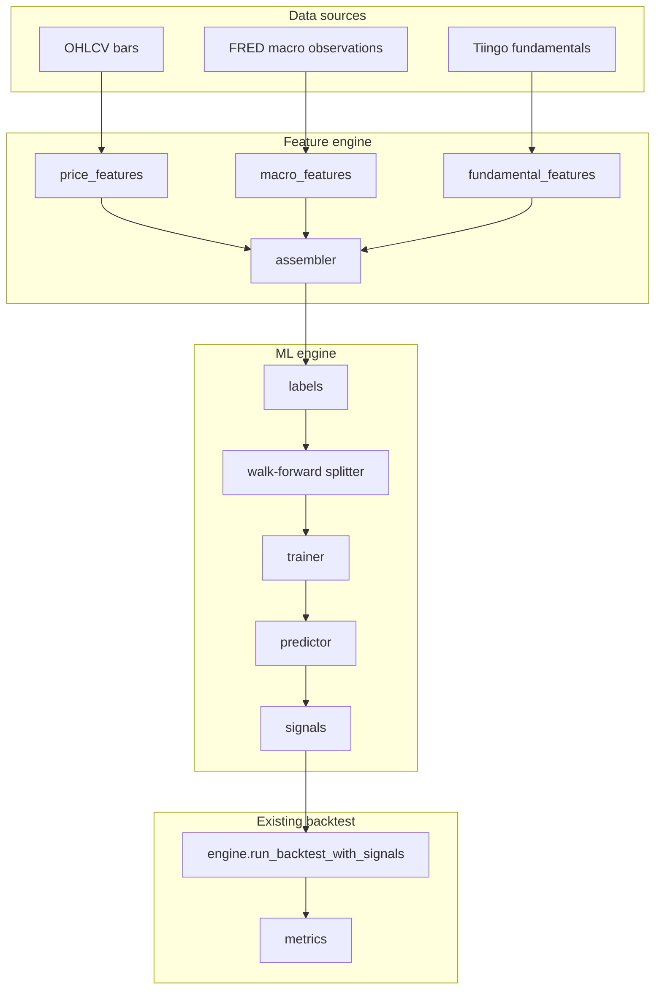

# ML Backtesting Manual

This document is the reference for machine-learning backtesting in the trading app. ML backtests reuse the existing portfolio simulator, performance metrics, and `backtest_runs` persistence. Only the **signal generation** path differs from rule-based algos: a classifier predicts the direction of forward returns, and those predictions become buy/sell/hold signals.

---

## Table of contents

1. [Quick start](#quick-start)
2. [Architecture](#architecture)
3. [Prerequisites](#prerequisites)
4. [Using the UI](#using-the-ui)
5. [Run modes](#run-modes)
6. [Feature modes and data sources](#feature-modes-and-data-sources)
7. [Models](#models)
8. [Parameters reference](#parameters-reference)
9. [Walk-forward validation](#walk-forward-validation)
10. [Signals and simulation](#signals-and-simulation)
11. [Evaluation metrics](#evaluation-metrics)
12. [Model persistence (train & inference)](#model-persistence-train--inference)
13. [REST API](#rest-api)
14. [Configuration](#configuration)
15. [Point-in-time rules (no look-ahead)](#point-in-time-rules-no-look-ahead)
16. [Code map](#code-map)
17. [Troubleshooting](#troubleshooting)

---

## Quick start

1. **Ingest data** for your symbol: OHLCV bars (required), macro series (optional), fundamentals (optional).
2. Open **Backtesting → ML** in the sidebar (`/backtesting/ml/:symbol`).
3. Choose a **decision timeframe**, **date range**, **model**, and **feature mode**.
4. Leave **Run mode** on **Walk-forward** and click **Run backtest**.
5. Review portfolio metrics, equity curve, ML summary (OOS accuracy, confusion matrix, feature importance), and trades.

For a frozen model without retraining: train once with **Train & save**, then switch **Run mode** to **Use saved model** and run again.

---

## Architecture

ML backtesting is a pipeline from raw data → features → labels → training/prediction → signals → simulation.



**Key design choices:**

| Topic | Behavior |
|-------|----------|
| Signal path | Precomputed per-bar signals fed into `run_backtest_with_signals` |
| Validation | Walk-forward only for training runs (no single random train/test split) |
| Persistence | Runs stored in `backtest_runs`; optional saved models in `ml_models` |
| API prefix | `/api/v1/backtest/ml/...` |

---

## Prerequisites

### OHLCV bars (always required)

ML needs enough bars for feature warmup, walk-forward windows, and label horizon. Minimum bar count:

```
minimum_bars = 50 (warmup) + train_bars + test_bars + label_horizon
```

Walk-forward defaults scale with timeframe (e.g. ~252 train bars on daily, fewer on intraday). The UI auto-adjusts when bar count is limited.

### Macro data (for `prices_macro` and full mode)

Ingest FRED series via **Ingestion → FRED Macro**. Default series (rates + inflation):

`DFF`, `DGS2`, `DGS10`, `T10Y2Y`, `CPIAUCSL`, `CPILFESL`, `PCEPI`

Series without ingested observations are omitted at run time; the UI shows a coverage warning.

### Fundamentals (for `prices_macro_fundamentals`)

Ingest Tiingo fundamentals for the symbol. The symbol must be **entitled** under your Tiingo fundamentals tier (DOW30 on free tier, or addon active). Non-entitled symbols receive a `400` error in full mode.

Sparse fundamentals coverage may introduce **survivorship bias** — warnings are surfaced in `ml_summary.fundamental_warnings`.

---

## Using the UI

**Route:** `/backtesting/ml/:symbol`

**Page layout:**

| Section | Purpose |
|---------|---------|
| Instrument search | Pick stock/ETF symbol |
| Decision timeframe | Bar size for features, labels, and trade execution |
| Date range | Backtest window (same controls as Algos page) |
| ML panel | Model, feature mode, walk-forward params, run controls |
| Results | Metrics cards, equity chart, ML charts, trade list |

**Info tooltips:** Every ML input label has a hover tooltip (`FieldLabel` + `mlBacktestHelp.ts`) explaining the parameter.

### Feature mode selector

| Mode | Label | Includes |
|------|-------|----------|
| `prices_only` | Prices only | OHLCV-derived features |
| `prices_macro` | Prices + macro | OHLCV + selected FRED series |
| `prices_macro_fundamentals` | Full | OHLCV + macro + fundamentals |

When macro or fundamentals are enabled, multi-select pickers appear. Coverage warnings show before you run.

### Walk-forward parameters

| Field | Meaning |
|-------|---------|
| Label horizon | Bars ahead used to define up/down label |
| Train bars | In-sample window per fold |
| Test bars | Out-of-sample window where predictions become signals |
| Step bars | How far the training window advances between folds |
| Buy / sell threshold | Probability cutoffs for buy/sell (hold between them) |

Model-specific fields appear for tree models:

- **Random forest estimators** (`ml_random_forest`)
- **Gradient boosting iterations** (`ml_gradient_boosting`)

### Results panels

After a completed run, the UI shows:

- **Portfolio metrics** — total return, Sharpe, max drawdown, etc. (same as rule-based backtests)
- **Buy & hold benchmark** — overlaid equity curve
- **ML summary** — OOS accuracy, precision/recall/F1, signal counts, feature names
- **Confusion matrix** — classification performance on labeled bars
- **OOS accuracy chart** — per walk-forward window (walk-forward mode only)
- **Feature importance** — tree-based models only (random forest, gradient boosting)
- **Compare panel** — side-by-side runs across all three feature modes

### Compare feature modes

The **Compare** action runs three backtests sequentially (prices only, prices + macro, full) with the same symbol, range, model, and walk-forward settings. Results appear in a table with OOS accuracy, F1, total return, Sharpe, and signal counts.

---

## Run modes

### Walk-forward (default)

For each fold:

1. Train on the in-sample window.
2. Predict probabilities on the out-of-sample window only.
3. Advance the window by `step_bars` and repeat.

Predictions exist **only** on OOS bars. In-sample bars have `null` probabilities → `hold` signals. This prevents training data from leaking into simulated trades.

### Use saved model (inference)

1. Train once via **Train & save** or `POST /backtest/ml/train`.
2. Select the saved model and set **Run mode** to **Use saved model**.
3. Run applies the frozen joblib artifact to all bars with valid features.

Inference validates:

- `feature_mode` matches the saved model
- Feature names and order match `feature_schema` exactly

Inference runs do **not** produce walk-forward OOS accuracy (`oos_window_count: 0`). Classification metrics are computed over all labeled bars with valid predictions.

---

## Feature modes and data sources

### Price features (`price_features.py`)

Built from OHLCV only. First **50 bars** are warmup (`FEATURE_WARMUP_BARS`) and produce no feature row.

| Feature | Description |
|---------|-------------|
| `ret_1`, `ret_5`, `ret_20` | Percent returns over 1, 5, 20 bars |
| `vol_20` | Rolling 20-bar return volatility |
| `rsi_14` | 14-bar RSI |
| `sma20_dist`, `sma50_dist` | Distance from close to SMA (ratio − 1) |
| `hl_range` | (high − low) / close |

Lookbacks count **bars**, not calendar time — so the same feature names apply across timeframes.

### Macro features (`macro_features.py`)

For each selected FRED series, four columns:

| Column | Description |
|--------|-------------|
| `{series}_level` | Latest observation on or before bar date (forward-filled) |
| `{series}_chg_1m` | Percent change vs prior observation (offset depends on series frequency) |
| `{series}_chg_3m` | 3-month-style change |
| `{series}_days_since_update` | Calendar days since last observation |

**As-of join:** `asof_join.py` aligns irregular macro releases to bar dates. Optional `macro_publication_lag_days` (keyed by series category) shifts the lookup date backward to model publication delay.

### Fundamental features (`fundamental_features.py`)

For each selected metric, four columns:

| Column | Description |
|--------|-------------|
| `{metric}_level` | Latest value as-of report **publication date** (`fundamentals.time`) |
| `{metric}_yoy` | Year-over-year percent change |
| `{metric}_qoq` | Quarter-over-quarter percent change |
| `{metric}_quarters_since_report` | Days since last report ÷ 91.25 |

**Default metrics:** revenue, grossProfit, opinc, netinc, eps, ebitda, freeCashFlow, ncfo, totalAssets, debt, equity, roe, roa, debtEquity, grossMargin, profitMargin, currentRatio.

**Period type:** `quarterly` (fiscal quarters) or `annual` (FY statements).

YoY/QoQ missing values are imputed as `0.0`; missing levels cause the bar row to be skipped.

---

## Models

Three classifiers are available via the model catalog:

| ID | Label | Library | Notes |
|----|-------|---------|-------|
| `ml_logistic` | Logistic Regression | sklearn `LogisticRegression` | Linear baseline, fast |
| `ml_random_forest` | Random Forest | sklearn `RandomForestClassifier` | Non-linear; exposes feature importance |
| `ml_gradient_boosting` | Gradient Boosting | sklearn `HistGradientBoostingClassifier` | Strong non-linear model; feature importance |

All models predict **probability of upward forward return** (class `1`). The trainer uses `random_state=42` for reproducibility.

---

## Parameters reference

### Defaults (daily timeframe)

```json
{
  "feature_mode": "prices_only",
  "macro_series_ids": ["DFF", "DGS2", "DGS10", "T10Y2Y", "CPIAUCSL", "CPILFESL", "PCEPI"],
  "macro_publication_lag_days": {},
  "fundamental_metrics": ["revenue", "grossProfit", "..."],
  "fundamental_period_type": "quarterly",
  "label_horizon": 5,
  "train_bars": 252,
  "test_bars": 63,
  "step_bars": 63,
  "buy_threshold": 0.55,
  "sell_threshold": 0.45,
  "random_forest_estimators": 100,
  "gradient_boosting_max_iter": 100
}
```

### Timeframe-aware defaults

When timeframe changes, walk-forward defaults auto-scale via `bars_per_year`:

| Timeframe | Typical train | Typical test/step | Label horizon |
|-----------|---------------|-------------------|---------------|
| Intraday (e.g. `1h`) | Scaled to ~1 year of bars | ~63/252 of train | 5 |
| `1d` | 252 | 63 | 5 |
| `1w` | 52 | ~13 | 4 |
| `1mo` | 12 | ~3 | 3 |

Intraday runs also respect `INTRADAY_BAR_LIMIT` — the UI may shrink train/test to fit available bars.

### Constraints (enforced server-side)

| Parameter | Range |
|-----------|-------|
| `label_horizon` | 1 – 60 |
| `train_bars` | 30 – 2000 |
| `test_bars` | 5 – 500 |
| `step_bars` | 1 – 500 |
| `buy_threshold` | 0.51 – 0.99 |
| `sell_threshold` | 0.01 – 0.49 |
| `random_forest_estimators` | 10 – 500 |
| `gradient_boosting_max_iter` | 10 – 500 |

**Rule:** `buy_threshold` must be **greater than** `sell_threshold`.

### Inference-only parameter

| Parameter | Description |
|-----------|-------------|
| `model_id` | UUID of a saved model (in `params` on `POST /run`) |

---

## Walk-forward validation

Windows are built by `splitter.build_walk_forward_windows`:

```
train:  [train_start, train_start + train_bars)
test:   [train_end, train_end + test_bars)
next:   train_start += step_bars
```

Example with `train=252`, `test=63`, `step=63` on daily data:

- Fold 1: train bars 0–251, test 252–314
- Fold 2: train bars 63–314, test 315–377
- … until test window exceeds bar count

Folds with fewer than 2 labeled samples or only one class are skipped.

**Labels** use future returns (`labels.py`): at bar `i`, label = 1 if `close[i + horizon] > close[i]`, else 0. Labels are used **only** for training and evaluation — never as features.

---

## Signals and simulation

`signals.probabilities_to_signals` maps predicted probability to:

| Condition | Signal |
|-----------|--------|
| `prob >= buy_threshold` | `buy` |
| `prob <= sell_threshold` | `sell` |
| otherwise | `hold` |
| `prob is null` | `hold` |

The simulator (`run_backtest_with_signals`) executes trades at the **next bar open** after a signal, with commission applied per trade. This matches rule-based algo execution semantics.

---

## Evaluation metrics

Stored in `ml_summary` on each run (also in `backtest_runs.params.ml_summary`):

| Field | Walk-forward | Inference |
|-------|--------------|-------------|
| `mean_oos_accuracy` | Mean accuracy across OOS folds | `null` |
| `window_accuracies` | Per-fold accuracies | `[]` |
| `oos_window_count` | Number of folds | `0` |
| `precision`, `recall`, `f1` | Over all OOS predictions | Over all labeled bars with predictions |
| `confusion_matrix` | 2×2 matrix `[ [TN, FP], [FN, TP] ]` | Same |
| `feature_importance` | From last fold's model (tree models) | From saved model |
| `signal_counts` | `{ buy, sell, hold }` | Same |
| `feature_names` | Ordered column names used | Same |
| `macro_warnings`, `fundamental_warnings` | Data coverage notes | Same |

Portfolio metrics (return, Sharpe, drawdown, etc.) come from the standard backtest metrics module against buy-and-hold benchmark.

---

## Model persistence (train & inference)

### Database

Table `ml_models` (migration `011_create_ml_models.sql`):

| Column | Purpose |
|--------|---------|
| `id` | UUID primary key |
| `name` | User-visible name |
| `model_type` | e.g. `ml_random_forest` |
| `feature_mode` | Must match at inference |
| `feature_schema` | JSON `{ version, feature_names[] }` |
| `hyperparams` | Full validated param snapshot |
| `train_metrics` | Accuracy, precision, recall, F1, sample count |
| `artifact_path` | Path to joblib file on disk |
| `created_at` | Timestamp |

### Artifacts

Serialized sklearn models are stored as `{uuid}.joblib` under `ML_ARTIFACT_DIR` (default `./data/ml_models`).

### Train workflow

1. UI: **Train & save** or API: `POST /backtest/ml/train`
2. Builds features + labels for the full date range
3. Trains on **all** labeled rows (not walk-forward)
4. Persists metadata + joblib artifact
5. Returns model id for inference runs

### Inference workflow

1. Set `params.model_id` on `POST /backtest/ml/run`
2. Server loads artifact, validates schema and feature mode
3. Predicts on all bars; no retraining

---

## REST API

Base path: `/api/v1/backtest/ml`

| Method | Path | Description |
|--------|------|-------------|
| `GET` | `/models` | Algorithm catalog (types, defaults, constraints) |
| `GET` | `/saved-models` | List persisted models |
| `GET` | `/saved-models/{id}` | Single saved model metadata |
| `POST` | `/train` | Train on date range and persist |
| `POST` | `/run` | Walk-forward or inference backtest |
| `GET` | `/{run_id}/results` | Full results including `ml_summary` |

### Example: walk-forward run

```http
POST /api/v1/backtest/ml/run
Content-Type: application/json

{
  "symbol": "AAPL",
  "model_type": "ml_logistic",
  "timeframe": "1d",
  "start": "2020-01-01T00:00:00Z",
  "end": "2024-12-31T00:00:00Z",
  "initial_cash": 10000,
  "commission_bps": 0,
  "params": {
    "feature_mode": "prices_only",
    "label_horizon": 5,
    "train_bars": 252,
    "test_bars": 63,
    "step_bars": 63,
    "buy_threshold": 0.55,
    "sell_threshold": 0.45
  }
}
```

### Example: inference run

```http
POST /api/v1/backtest/ml/run

{
  "symbol": "AAPL",
  "model_type": "ml_random_forest",
  "timeframe": "1d",
  "params": {
    "feature_mode": "prices_macro",
    "model_id": "550e8400-e29b-41d4-a716-446655440000",
    "macro_series_ids": ["DFF", "DGS10"],
    "buy_threshold": 0.55,
    "sell_threshold": 0.45
  }
}
```

### Example: train and save

```http
POST /api/v1/backtest/ml/train

{
  "symbol": "AAPL",
  "model_type": "ml_gradient_boosting",
  "timeframe": "1d",
  "name": "AAPL GB full features",
  "params": {
    "feature_mode": "prices_macro_fundamentals",
    "gradient_boosting_max_iter": 150
  }
}
```

### Error responses

| Status | Typical cause |
|--------|---------------|
| `400` | Invalid params, insufficient bars, schema mismatch, non-entitled fundamentals |
| `404` | Unknown symbol or saved model |
| `500` | Unexpected training/simulation failure (run marked `failed` in DB) |

---

## Configuration

| Variable | Default | Description |
|----------|---------|-------------|
| `ML_ARTIFACT_DIR` | `./data/ml_models` | Directory for joblib model files |

Set in backend `.env`. Directory is created automatically on first save.

Tiingo fundamentals entitlement is controlled by `tiingo_fundamentals_tier` in backend config.

---

## Point-in-time rules (no look-ahead)

These rules are enforced throughout the pipeline:

1. **Features at bar `i`** use only data available at or before bar `i`.
2. **Macro** uses as-of join with optional publication lag — no future observations.
3. **Fundamentals** align to report **publication time**, not fiscal period end.
4. **Labels** use future returns for training targets only — never as input features.
5. **Walk-forward** produces predictions only on OOS windows; in-sample bars stay `hold`.
6. **Inference** applies a model trained on past data to current features — no refit during the backtest.

Violating any of these would inflate backtest performance; the architecture is designed to prevent it.

---

## Code map

| Area | Path |
|------|------|
| ML orchestration | `tiingo_backend/features/ml/orchestrator.py` |
| Feature builder | `tiingo_backend/features/ml/feature_builder.py` |
| Price / macro / fundamental features | `price_features.py`, `macro_features.py`, `fundamental_features.py` |
| As-of join | `tiingo_backend/features/ml/asof_join.py` |
| Labels, splitter, trainer, predictor, signals | `labels.py`, `splitter.py`, `trainer.py`, `predictor.py`, `signals.py` |
| Evaluation & artifacts | `evaluation.py`, `artifacts.py` |
| Param catalog & validation | `catalog.py` |
| ML routes | `tiingo_backend/routes/backtest_ml.py` |
| DTOs | `tiingo_backend/dtos/ml_backtest_dto.py` |
| Model DAL | `tiingo_backend/dal/ml_model_dal.py` |
| Precomputed-signal simulator | `tiingo_backend/features/backtesting/engine.py` |
| ML page | `tiingo_frontend/src/pages/backtesting/MLPage.tsx` |
| ML panel (controls + results) | `tiingo_frontend/src/components/backtesting/MLBacktestPanel.tsx` |
| Compare panel | `tiingo_frontend/src/components/backtesting/MlComparePanel.tsx` |
| Frontend config & validation | `tiingo_frontend/src/utils/mlBacktestConfig.ts` |
| Field tooltips | `tiingo_frontend/src/utils/mlBacktestHelp.ts` |
| API client | `tiingo_frontend/src/api/endpoints.ts` (`mlBacktestApi`) |

---

## Troubleshooting

### "Insufficient bars for ML backtest"

Increase the date range or reduce `train_bars`, `test_bars`, or `label_horizon`. Check `minimumBarsRequired` in the UI or `minimum_bars_required()` on the backend.

### "No ingested macro series available"

Ingest FRED data for at least one selected series, or switch to **Prices only**.

### "Symbol is not entitled for fundamentals"

Use a DOW30 symbol on the free tier, enable the fundamentals addon, or switch away from **Full** feature mode.

### "Feature schema mismatch for inference"

Retrain the model with the same feature mode, macro series, and fundamental metrics you plan to use at inference. Column names and order must match exactly.

### "buy_threshold must be greater than sell_threshold"

Raise buy threshold or lower sell threshold so a dead zone exists for `hold` signals.

### Low OOS accuracy but positive returns

Classification accuracy measures label prediction, not trading P&L. Threshold tuning, horizon choice, and market regime all affect portfolio metrics independently.

### Sparse fundamentals warning

Some metrics have no ingested rows for the symbol. Omitted metrics reduce feature count; sparse history may bias results toward periods with richer reporting.

---

## Supported timeframes

All OHLCV decision timeframes from the Algos page are supported (`1m`, `5m`, `15m`, `30m`, `1h`, `4h`, `1d`, `1w`, `1mo`). Walk-forward defaults and minimum bar checks scale automatically per timeframe.
